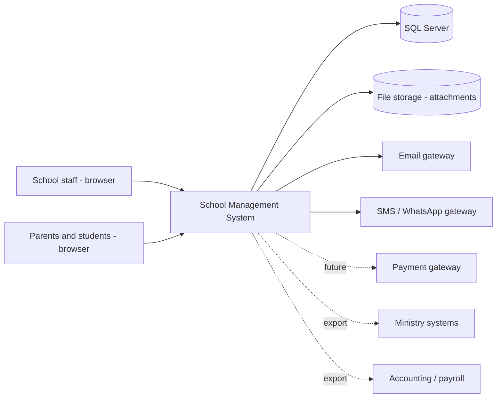

# 02 — System Architecture

**Phase:** 1 — Foundation | **Status:** Draft for review | **Owner:** Software Architect + Database Architect + Security Architect

> Conceptual architecture only. No tables, no code. Database design is Phase 10; this document fixes the architectural decisions the modules will rely on.

---

## 1. Architectural style — decision

**Modular monolith on Clean Architecture.** One deployable ASP.NET Core MVC application, internally partitioned by business module, one SQL Server database per tenant strategy (§4).

Rationale: a school runs as one transactional system (admission touches students, fees, sections, notifications in one unit of work). Microservices would multiply operational cost for schools with minimal IT staff. Module boundaries are enforced in code so a future split remains possible.

## 2. Clean Architecture layers

| Layer | Contents | Depends on |
|-------|----------|------------|
| **Domain** | Entities, value objects (Money, PersonName, HijriDate), domain events, business-rule enforcement | nothing |
| **Application** | Use cases (commands/queries), validation, workflow orchestration, authorization policies, interfaces (ports) | Domain |
| **Infrastructure** | EF Core persistence, identity, file storage, email/SMS gateways, report engine, background jobs, caching | Application (implements its ports) |
| **Presentation** | ASP.NET Core MVC + Bootstrap + jQuery: staff app areas per module, parent/student portal area, localization middleware | Application |

Cross-cutting services (consumed by all modules, specified in docs 05–10): **Workflow engine, Security/Permissions, Audit, Numbering, Notifications, Attachments** — plus Localization and Background Jobs.

## 3. System context

Integrations in v1 are **outbound and file/API-export based** (ministry, accounting, payroll prep). Payment gateway is design-ready, activated later (README Q5).

## 4. Multi-tenancy & multi-school strategy — decision

| Aspect | Decision |
|--------|----------|
| Data model | **Every tenant-owned row carries `SchoolId`** from v1, even when one school is deployed. This is ADR-2 and non-negotiable for the Multi-School future. |
| v1 deployment | One database = one customer. A customer with one school simply has one School row. |
| Multi-school future | Same schema already supports N schools per database (school groups); permissions are school-scoped (doc 06). Cross-school consolidation = reporting concern, not schema change. |
| Isolation enforcement | School scoping applied centrally (global query filters + authorization policies), never left to individual screens. |

## 5. Multi-academic-year strategy — decision

1. **Academic Year is a scoping dimension, not a filter convenience.** All transactional data (enrollment, attendance, marks, fees, timetable…) belongs to exactly one academic year.
2. **Person data is year-independent** (student, parent, employee identity, medical file); **participation data is year-scoped** (a student's enrollment in Grade 5 Section A in 2026-2027).
3. One **Active** year per school for daily work; prior years remain readable (permission-controlled); a **Preparation** status allows building next year (sections, fees, timetable) while the current year runs.
4. **Rollover is a guided workflow** (Academic Years module): promotion decisions → re-registration → section assignment → fee generation. Never a data-copy script.
5. Users carry a "working academic year" context switchable in the UI shell; every screen displays it prominently.

## 6. Localization, calendars, time — decisions

| Concern | Decision |
|---------|----------|
| UI languages | AR + EN via resource files; architecture supports adding languages (README Q10) |
| RTL | Bootstrap RTL build; layout fully mirrored; UI Guide (Phase 11) defines standards |
| Bilingual data | Every named master-data entity: `NameAr` + `NameEn` mandatory (BR-GLB group in doc 03); reports/certificates render in either language |
| Calendars | **Store Gregorian (date types); display/entry Hijri where school config enables it**; certificates can print both. Hijri conversion is a domain service (Umm al-Qura), never duplicated per screen |
| Time zones | School has a time zone; store UTC; display in school TZ; attendance "day" boundaries computed in school TZ |
| Numbers/currency | Currency per school; VAT-aware money handling; Arabic-Indic digit display is a UI preference, storage is invariant |

## 7. Cross-cutting service concepts (detailed in Phase 2 docs)

| Service | One-line concept | Doc |
|---------|------------------|-----|
| Workflow | Configurable state machines + approval chains (admission, discount, refund, mark change, certificate, leave) | 05 |
| Security | Roles → permissions (module/screen/action) × data scopes (school/year/grade/section); deny-by-default | 06 |
| Audit | Who/what/when/before/after for sensitive entities; login and permission-change auditing; tamper-evident | 07 |
| Numbering | Per-school, per-document-type configurable formats with sequence, year segment, prefix; gap policy defined | 08 |
| Notifications | Template-driven, bilingual, multi-channel (in-app, email, SMS, WhatsApp-ready); event-subscription model | 09 |
| Attachments | Central document store: typed, size/type-limited, virus-scan hook, linked to any entity, permission-inheriting | 10 |

## 8. Technology decisions & challenges

| # | Item | Decision / challenge |
|---|------|----------------------|
| T-1 | **.NET 5 (specified)** | **Challenged — EOL May 2022.** Recommend **.NET 8 LTS**. Same MVC/EF Core programming model; a commercial product cannot ship on an unpatched runtime. Awaiting owner decision (README Q1). |
| T-2 | EF Core | Approved; migrations as schema source of truth (Phase 10 defines naming standards) |
| T-3 | SQL Server | Approved; Arabic-capable collation/UTF-8 decision deferred to Phase 10 |
| T-4 | Bootstrap + jQuery | Approved for product consistency; Bootstrap 5 (native RTL). Recommendation: keep jQuery usage thin (validation, DataTables, select2-style pickers) so a future front-end refresh is possible |
| T-5 | Reporting engine | Decision needed in Phase 9: HTML/print CSS + PDF generator vs. commercial report tool. Requirement: bilingual + RTL-perfect PDF output |
| T-6 | Background jobs | Required (notifications, heavy reports, rollover, backup verification) — in-process scheduler acceptable for v1 |
| T-7 | File storage | Abstracted: disk (on-prem) or blob storage (cloud) behind one interface |
| T-8 | Caching | Per-tenant cache for master data & permissions; invalidation on config change |

## 9. Environments & delivery

Standard product pipeline: Dev → QA → Staging (demo school with seeded bilingual data) → Production per customer. Versioned releases; EF migrations run per tenant on upgrade; every release ships upgrade notes. A **demo tenant with realistic bilingual seed data** is a product deliverable (sales + testing).

## 10. Architecture decision records (running list)

| ADR | Decision | Status |
|-----|----------|--------|
| ADR-1 | Modular monolith, Clean Architecture | **Accepted 2026-08-13** |
| ADR-2 | SchoolId on all tenant data from v1 | **Accepted 2026-08-13** |
| ADR-3 | Academic year as mandatory scope on transactional data | **Accepted 2026-08-13** |
| ADR-4 | Store Gregorian + UTC; display Hijri + school TZ | **Accepted 2026-08-13** |
| ADR-5 | Bilingual (Ar/En) mandatory on named master data | **Accepted 2026-08-13** |
| ADR-6 | .NET 8 LTS instead of .NET 5 | **Accepted 2026-08-13**; amended by CR-1 2026-08-14 → .NET 10 LTS; **superseded by CR-2 2026-08-14 (owner directive): build targets .NET 5** — architect's EOL objection stands on record (no security patches since May 2022); risk formally accepted by owner and carried in the risk register; runtime upgrade path (net5→LTS) kept open by avoiding removed-API surface where practical |
| ADR-7 | Soft delete + status lifecycles; no hard delete of transacted data | **Accepted 2026-08-13** |

## 11. Open questions

1. ADR-6 (.NET version) — blocking for Phase 2 sign-off.
2. Cloud hosting target (affects file storage, backup, SLA design in modules 35–36).
3. Reporting engine shortlist (T-5) — needed before Phase 9.
4. Is offline/poor-connectivity operation required for any school (affects attendance capture design)? Assumed **no** for v1.
