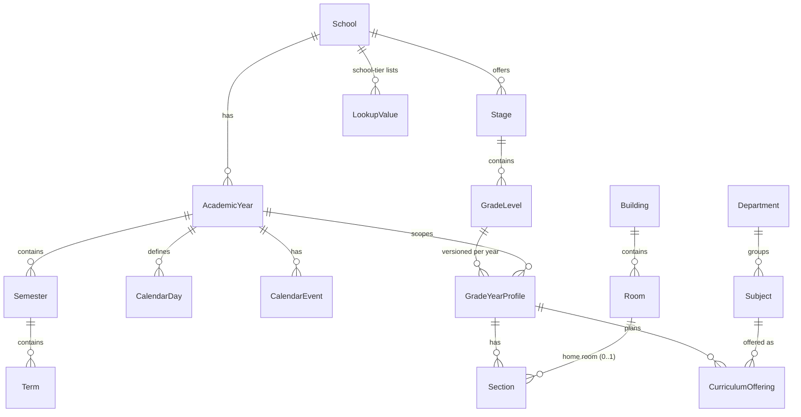
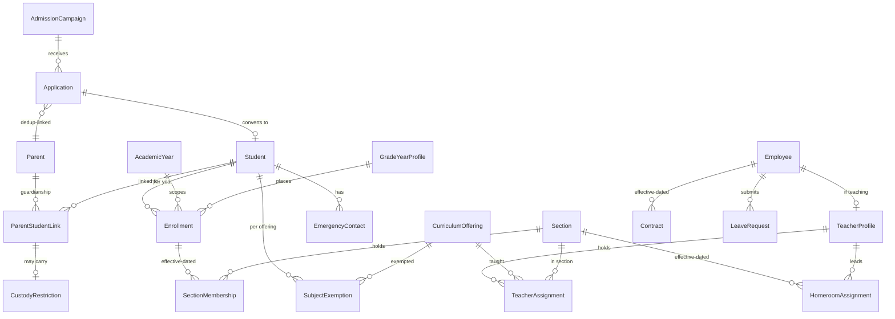
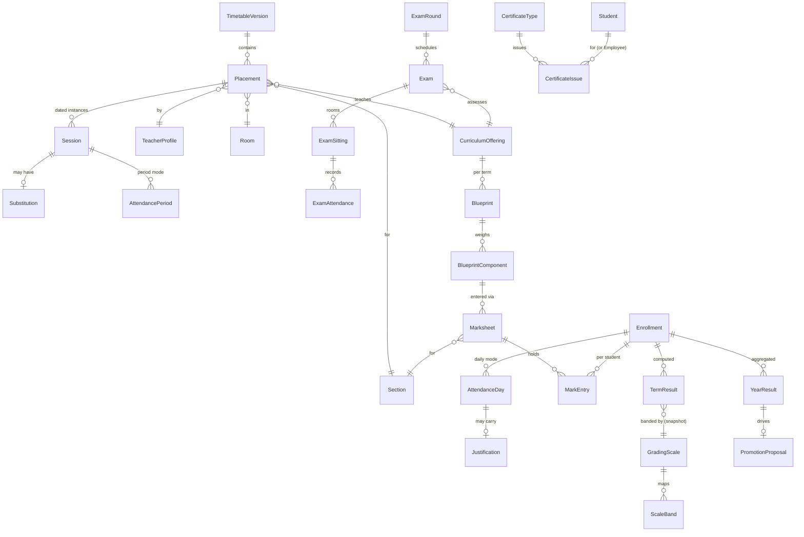
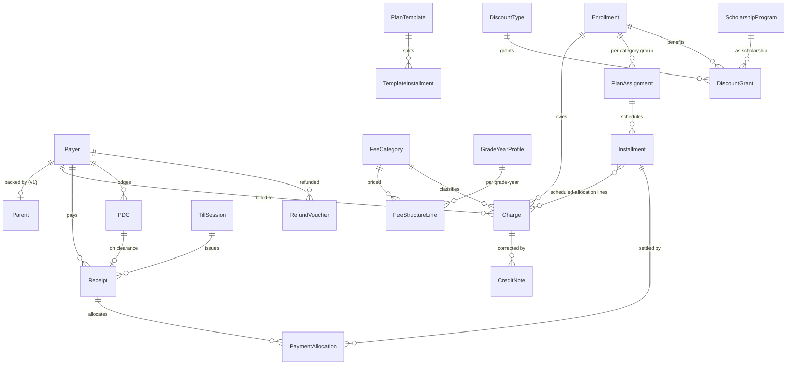
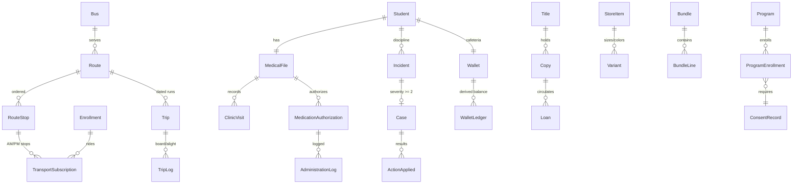
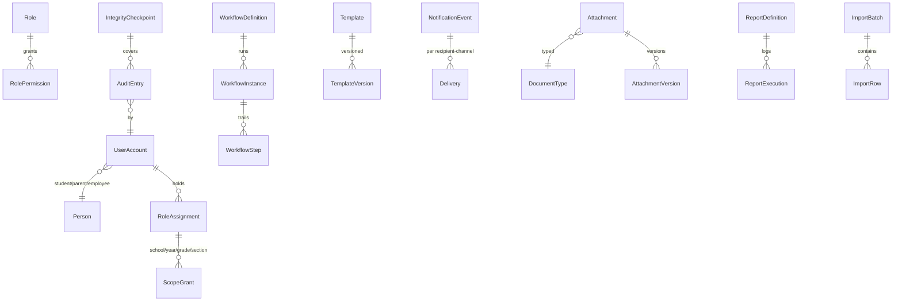

# Database 02 — ER Model

**Phase:** 10 | **Status:** Draft for review | **Owner:** Database Architect

> Conceptual/logical ER diagrams per cluster, drawn from the approved module Database Concept sections. Cardinality: `||` one, `o{` many. Standard columns (§4 of doc 01) omitted from diagrams for legibility.

---

## 1. Core patterns (apply everywhere)

1. **Tenancy spine:** `core.School` ← every tenant table via `SchoolId` (ADR-2).
2. **Year spine:** `core.AcademicYear` ← every transactional table via `AcademicYearId` (ADR-3).
3. **Person vs participation:** identity tables (`Student`, `Parent`, `Employee`) are year-independent; participation tables (`Enrollment`, `TeacherAssignment`, `TransportSubscription`) are year-scoped (doc 02 §5).
4. **Effective-dating:** memberships and assignments use `EffectiveFrom/EffectiveTo` rows, never overwritten (BR-SCN-005, BR-TCH-002, BR-SCH-004).
5. **Official documents:** strict-numbered, immutable-after-post, corrected by reversal documents (BR-GLB-041/062).
6. **Snapshotting:** published results, certificates, rendered notifications, and workflow versions store their input snapshots (BR-GRA-003, BR-CRT-004, BR-NOT-008, BR-WF-008).

## 2. Core structure (schema `core`)

Notes: `GradeYearProfile` is the year-versioning vehicle (BR-GRD-008); `CurriculumOffering` — not `Subject` — is the FK target for placements, marksheets, assignments (BR-SUB model). `CalendarDay` materializes day types per date (BR-CAL §7).

## 3. People (schema `ppl`)

Notes: `ParentStudentLink` serves both Module 10 and 11 views (one table). Withdrawal/offboarding cases, waiting lists, merges are workflow/state tables around these spines.

## 4. Academic operations (schema `acad`)

Notes: one marks store (`Marksheet`/`MarkEntry`) fed by Modules 16+17 (BR-EXM-007 note); results tables persist calculation snapshots (JSON column) per BR-GRA-003.

## 5. Finance (schema `fin`)

Notes: `Payer` is the v1.x sponsor-ready abstraction (BR-FEE-004). Position/aging are views over Charge/CreditNote/DiscountGrant-applications/PaymentAllocation (BR-FEE-008) — no stored balance except materialized read models (doc 04 §4).

## 6. Services (schema `svc`) — spine view

## 7. Platform (schemas `sec`, `aud`, `msg`, `doc`, `ops`) — spine view

Notes: `Attachment` links to owners polymorphically (`OwnerEntityType` + `OwnerEntityId` + enforced registry of valid owner types — reviewed pattern, accepted for the document store only; everywhere else FKs are physical). `AuditEntry` uses the same logical polymorphism by necessity (doc 07 §4 business-key capture compensates).

## 8. Cross-cluster dependency map

`core` ← everyone. `ppl` ← acad/fin/svc. `fin.Payer` ← ppl.Parent. `acad.Session` ← core placement chain. `sec/aud/msg/doc/ops` ← consumed product-wide via services (not FK-heavy — loose coupling by id + registry where polymorphic).

Estimated table count: **~190 tables** (inventory in doc 03) + ~35 views/read models (doc 04).
