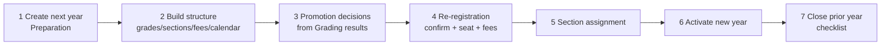

# Module 03 — Academic Years

**Phase:** 3 — Academic structure | **Status:** Draft for review | **Rule prefix:** `BR-AYR`

---

## 1. Purpose

Manage the academic year lifecycle — the scoping dimension of all transactional data (ADR-3) — including semesters/terms, year statuses, and the **year-end rollover workflow** that makes BO-03 ("rollover is routine") real.

## 2. Scope

**In:** academic year definition (dates, label, Hijri label), semester/term structure, year status lifecycle, working-year context, opening checklist, rollover workflow (promotion → re-registration → assignment → fee generation), closed-year posting control.
**Out:** calendar days/holidays (Module 04), promotion *criteria* (Module 17 — Grading defines pass/fail; this module consumes decisions), fee structures (Module 19 — this module triggers generation).

## 3. Business rules

| ID | Rule |
|----|------|
| BR-AYR-001 | Year label is generated from dates (e.g., "2026–2027" / "١٤٤٨هـ" display); dates must not overlap another year of the same school; a year spans 6–14 months (guard against typos). |
| BR-AYR-002 | Status lifecycle: `Preparation → Active → Closing → Closed → Archived` (extends BR-GLB-021). Exactly one Active per school; at most one in Preparation. |
| BR-AYR-003 | **Preparation** allows building structure (sections, timetable drafts, fee structures, re-registration) for the next year while the current runs; no attendance/marks/receipts can post to a Preparation year except re-registration fees (explicitly allowed, flagged). |
| BR-AYR-004 | **Activation** requires the opening checklist green: calendar defined (Module 04), grades/sections created, fee structures approved, grading scales confirmed, timetable published or explicitly deferred (permission). Activating the new year moves the prior Active to Closing. |
| BR-AYR-005 | **Closing** is a controlled window (default 60 days, configurable): marks completion, fee settlements, and corrections continue with heightened audit; new enrollments are blocked. `Closing → Closed` requires the closing checklist: all mark sheets approved or explicitly voided, attendance complete, receivable balances carried forward, pending workflows resolved. |
| BR-AYR-006 | **Closed** is read-only; posting requires WF-13 (per-transaction permission + reason, BR-GLB-022). **Archived** additionally drops the year from default pickers (data remains online per NF-P6). |
| BR-AYR-007 | Semester/term structure is configurable per year (e.g., 2 semesters × 2 terms; or 3 terms); assessment periods (Module 17) and fee installments (Module 20) reference these; structure locks once any marks or invoices reference it — later changes require a new structure version with Principal approval (P2). |
| BR-AYR-008 | The **rollover workflow** (§4) is the only path by which existing students enter the next year (BR-GLB-023); it is resumable, idempotent per student, and fully progress-tracked. |
| BR-AYR-009 | Receivable balances carry forward to the new year as opening balances on the student's account — history stays in the original year; the statement of account spans years (BR-GLB-064). |
| BR-AYR-010 | Every user session displays and operates in a working year (doc 02 §5); switching years is permission-scoped (doc 06); screens must visibly warn when the working year is not the Active year. |

## 4. Workflow — Year-End Rollover (WF-02 family)

| Step | Detail |
|------|--------|
| 3 — Promotion decisions | Auto-proposed per Grading module results (promote / retain / conditional); Registrar reviews exceptions; Principal approves the batch (P3). Graduating-grade students exit to Graduate status. |
| 4 — Re-registration | Per student: parent confirms (portal or counter), seat reserved against section capacity, re-registration fee (Module 19 policy) posted; non-returning students marked Not Re-registering (feeds withdrawal WF-03). Waiting-list applicants (Module 09) compete for unclaimed seats after the configured deadline. |
| 5 — Section assignment | Bulk tools: distribute by rules (balance size, gender policy, keep/split groups), manual drag adjustments; capacity enforced (Module 06 rules). |
| 6 — Activation | BR-AYR-004 checklist; enrollment records created; timetables/fees go live; portal switches default year. |

Progress dashboard per step (counts: decided/pending, confirmed/unconfirmed, assigned/unassigned); every step re-runnable for stragglers without touching completed students.

## 5. User roles

Registrar (owns rollover), Principal (approvals), Sys Admin (year creation/status), Finance Manager (fee generation & carry-forward steps), Stage Supervisors (promotion review within scope), Teachers (no direct role — supply grades via Module 17).

## 6. Permissions

| Action | Roles |
|--------|-------|
| Create/edit year & structure | Sys Admin |
| Activate / close year | Sys Admin + Principal approval (P2) |
| Run rollover steps | Registrar (3–5), Finance Manager (fee steps) |
| Approve promotion batch | Principal |
| Post into Closed year (WF-13) | Per-module grant, always audited |
| Switch working year beyond Active | Scope-based (doc 06) |

## 7. Database concept

Entities: `AcademicYear` (school, dates, status, labels); `Semester` / `Term` (ordered children, dates within year); `YearChecklist` (opening/closing items, status, actor); `RolloverBatch` + `RolloverStudentState` (per-student step status — makes BR-AYR-008 idempotency concrete); `Enrollment` (student × year × grade × section × status) — the pivotal year-scoped participation record referenced by attendance, marks, fees (BR-GLB-024). Carry-forward posts as opening-balance financial documents (Module 19 concept).

## 8. Required screens

1. Year list & status board (per school, lifecycle actions with checklists inline).
2. Year definition (dates, Hijri labels, semester/term builder with visual timeline).
3. Opening checklist / Closing checklist consoles (item status, owners, drill-through).
4. **Rollover cockpit** — step tabs with progress bars, exception queues, batch actions, per-student drill-down.
5. Promotion review grid (results-driven proposals, exception flags, approve batch).
6. Re-registration console (counter mode) + portal re-registration flow (parent side).
7. Section assignment board (drag-drop between sections, rule-based auto-distribute, capacity meters).

## 9. Validation rules

Date overlap and span guards (BR-AYR-001); term dates nested within semester within year; activation blocked with named missing checklist items; promotion decision mandatory for every enrolled student before activation (or explicit "undecided → blocked" list emptied); section assignment respects capacity/gender rules with permission-gated override (logged); carry-forward totals must reconcile: closing receivables = opening balances posted (hard check).

## 10. Reports

Year structure sheet (bilingual) · Rollover progress report (by step/grade/section) · Promotion outcome register (promoted/retained/conditional/graduated with approvals) · Re-registration status by grade (confirmed/pending/declined + conversion %) · Carry-forward reconciliation report · Closed-year posting register (WF-13 usage).

## 11. Dashboard widgets

Registrar: rollover step progress, unconfirmed re-registrations countdown. Principal: promotion exceptions pending, re-registration conversion vs. last year. Finance: carry-forward total, re-registration fees collected.

## 12. Notifications

`ReRegistrationOpen` → all current parents (portal+email); `ReRegistrationReminder` (configurable cadence) → unconfirmed parents; `PromotionDecided` → parents (with new grade); `YearActivated` → all staff; `ClosingWindowEnding` (D-7) → Principal, Registrar, Finance; `CarryForwardPosted` → Finance Manager.

## 13. Future enhancements

Multi-school synchronized rollover (group future); summer-term support as an optional mini-year; predictive re-registration (flag at-risk families early from payment/attendance signals); mid-year student intake wizard (exists via Admissions — enhancement is pro-rated fee automation, Module 19 Q).

## 14. Open questions

1. Re-registration deposit: separate fee category or advance on tuition? Finance policy — resolve in Module 19 (affects step 4 posting).
2. Conditional promotion (promoted pending makeup exam) — confirm it exists in target curricula; modeled as decision type consumed here, criteria in Module 17.
3. Default closing window length (60 days proposed) — pilot confirmation.
4. Can re-registration open while promotion decisions are incomplete (parents confirm seat before grade known)? Recommendation: **yes** — confirm seat first, grade follows; validate with pilot school.
